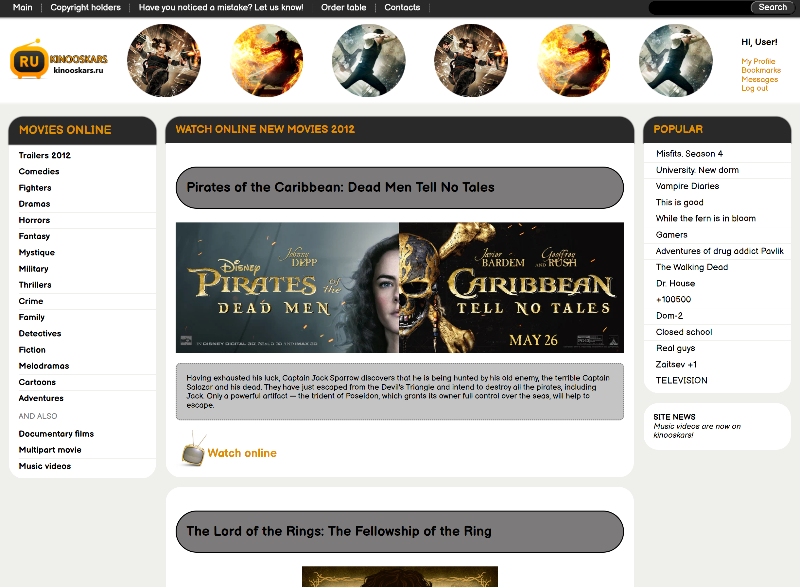

# Kinooskars

Kinooskars is a project that recreates the basic layout of my old website for movies. It was initially created while I was learning HTML and CSS and later enhanced with a burger menu using JavaScript. The layout is fully adaptive for various screen sizes.

## Technology Stack:

- HTML
- CSS
- JavaScript

## Demo

You can see the live demo of the project at [https://slavr7.github.io/kinooskars.ru/](https://slavr7.github.io/kinooskars.ru/)

## Installation and Usage

To run this project locally, follow these steps:

1. Clone this repository.
2. Open the `index.html` file in your web browser.

## Screenshot



## Features

- Responsive layout for different screen sizes.
- Burger menu implemented with JavaScript.

## Code Examples

Here's an example of how the burger menu is implemented in JavaScript:

```javascript
// JavaScript code for burger menu
const burgerMenu = document.querySelector('.burger-menu');

function toggleBurgerMenu() {
    burgerMenu.classList.toggle('burger-hidden');
}
```

## Contacts
- Email: [mylife0793@gmail.com](mailto:mylife0793@gmail.com)
- Telegram: https://t.me/skill_hunter 
- GitHub profile.
